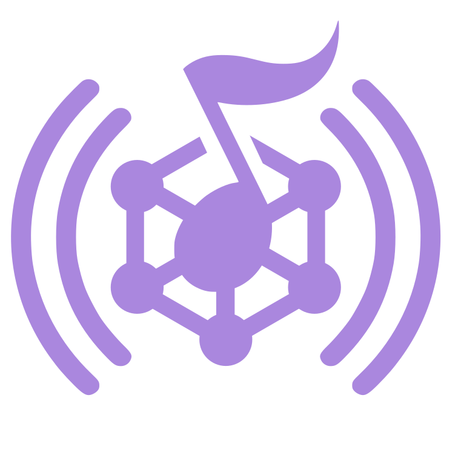

Melodi radio firmware
===

This firmware turns a LoRa board into a Melodi modem. It carries opaque Melodi
frames between the host kernel stack and the LoRa PHY and does nothing else.

The Melodi network stack lives in the host kernel modules (`../melodi`).
Addressing, discovery, identity, encryption, fragmentation, reliability,
ordering, queueing and airtime governance are all implemented there. This
firmware owns only the radio.

---

## Protocol

Host and radio speak the framed binary protocol defined in
`../melodi/src/proto/radio.h`. Both sides compile the same `radio.c`, so the
encoder and decoder cannot drift apart.

Every message is an eight octet header followed by a checksummed payload:

```text
0x4d 0x4c version type length[2] checksum[2] payload...
```

Host to radio:

| Message | Meaning |
| --- | --- |
| `IDENTIFY` | request firmware, hardware, packet MTU and queue depth |
| `CONFIGURE` | assign the locator and apply frequency, bandwidth, spreading factor, coding rate, transmit power and duty budget |
| `TRANSMIT` | queue one packet for the air |
| `RESET` | drop the configuration and idle the radio |

Radio to host:

| Message | Meaning |
| --- | --- |
| `INFO` | answer to `IDENTIFY` |
| `STATUS` | state, fault and queue occupancy, also sent every two seconds |
| `RECEIVE` | one received packet with source, destination, RSSI and SNR |
| `RESULT` | transmit outcome and measured airtime for one cookie |

The radio never parses a Melodi frame. It prefixes each transmission with an
eight octet header carrying the destination and source locators, and strips
that header again on receive.

## Boards

| Environment | Board | Pins |
| --- | --- | --- |
| `rpi` | Adafruit Feather RP2040 RFM | CS 16, INT 21, RST 17 |
| `m0` | Adafruit Feather M0 LoRa | CS 8, INT 3, RST 4 |
| `ttgo` | LilyGO TTGO LoRa32 v2 | CS 18, INT 26, RST 23 |

## Build

```sh
pio run -e rpi
pio run -e rpi -t upload
```

## Host test

The modem logic builds and runs on a workstation against stub Arduino and
RadioHead headers, driven by the same codec the kernel uses:

```sh
sh test/run.sh
```

It exercises identify, configure and transmit, and checks that the replies
decode back to the expected values.

## License

See the repository license.
